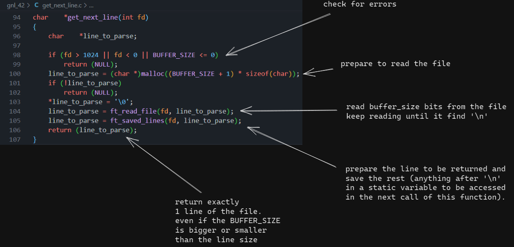

# Get next line 42 Project

## What is it?
This project is about programming a function that returns a line
read from a file descriptor.

<br>

### A few rules

<p>As most of 42's Projects, this one also have a few rules (such as the prohibition of the use of 
<span style="color:#33DAFF">for</span>,
<span style="color:#33DAFF"> VLA</span>,
<span style="color:#33DAFF"> global variables</span>
and others).</p> 

<br>

## How to use it

```Bash
git clone git@github.com:rodrigo-br/gnl_42.git

cd gnl_42/

touch main.c

(write a main)

cc main.c get_next_line.c get_next_line_utils.c -D BUFFER_SIZE=1024 && ./a.out
```

You can set any BUFFER_SIZE you want.

Suggestion of main:

```C
#include "get_next_line.h"
#include <fcntl.h>
#include <stdio.h>

int main (void)
{
	int		fd = open("main.c", O_RDONLY);
	char	*line;

	while (1)
	{
		line = get_next_line(fd);
		if (!line)
			break;
		printf("%s", line);
		free(line);
	}
	close(fd);
	return (0);
}
```
You can change the <b>"main.c"</b> to any other file you want, even the stdin.

Note that you have to read the entire file to free all the memory since <b>get_next_line</b> uses a dinamic allocated static variable and only frees it after reading the last line of the file.

Also, the get_next_line can read from multiple fds at the same time. You just have to keep different fds in different variables.

<br>

